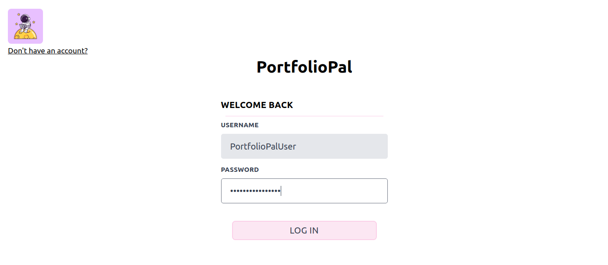
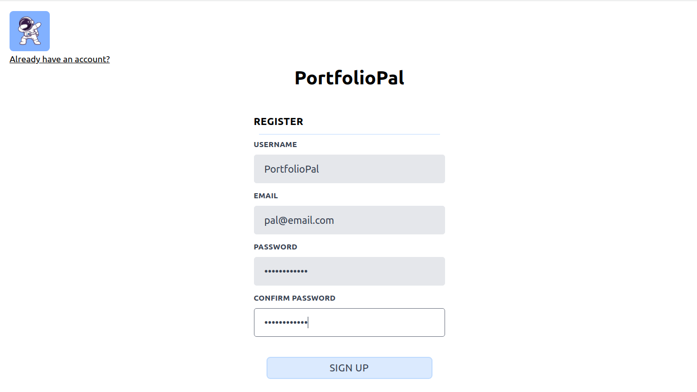
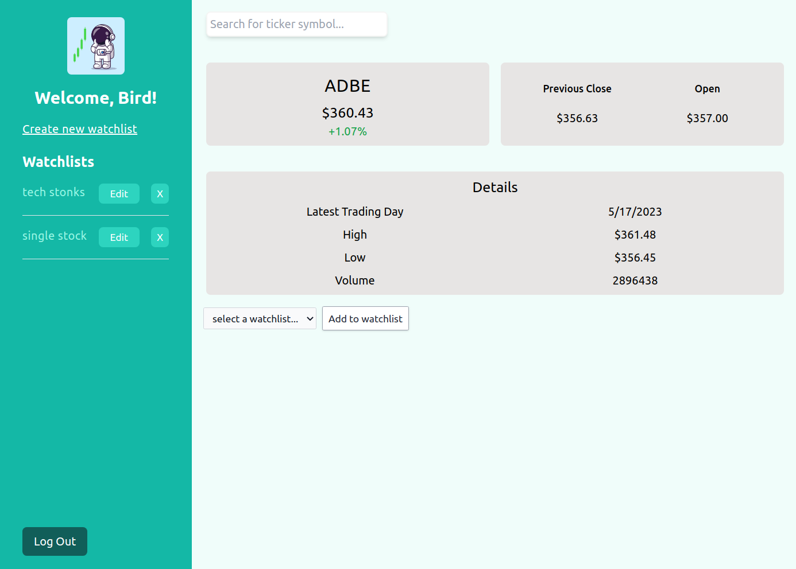
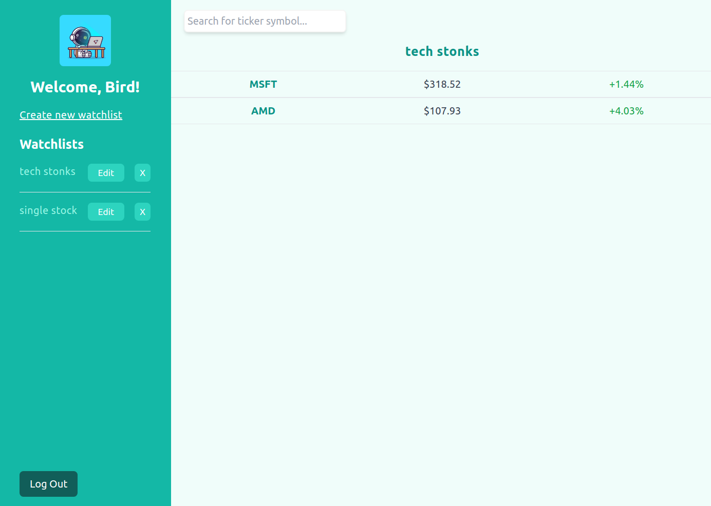

<h1 align="center"><a href="">Portfolio Pal</a></h1>

<!-- TABLE OF CONTENTS -->

  
Table of Contents

  <ol>
    <li><a href="#background">Background</a></li>
    <li><a href="#screenshots">Screenshots</a></li>
    <li><a href="#technologies-used">Technologies Used</li>
    <li><a href="#getting-started">Getting Started</a></li>
    <li><a href="#next-steps">Next Steps</a></li>
    <li><a href="#resources">Resources</a></li>
  </ol>

## Background

Do you have trouble keeping track of the stocks you want to monitor? **Portfolio Pal** could be your consolidated solution - the ultimate stock tracking companion! With our app, you can build personalized watchlists to track your most-watched stocks in real time and see more detailed information about each stock on its own detail page.

## Screenshots

## Technologies Used

- [React](https://react.dev/)
- [Node.js](https://nodejs.org/en) (with [Express](https://expressjs.com/))
- [MongoDB](https://www.mongodb.com/) (with [Mongoose](https://mongoosejs.com/))
- [Tailwind CSS](https://tailwindcss.com/)

## Getting Started

- [Website]()
- [Trello board](https://trello.com/b/vYuPESd7/stonks-planning)

## Next Steps

- Add ability to delete stocks from watchlist
- Add a populated search bar feature
- Display graphs based on stock price over time
- Implement paper trading

## Resources

- [Alpha Vantage API](https://www.alphavantage.co/documentation/)
- [Tailwind CSS components](https://v1.tailwindcss.com/components)
- [Stock pictures](https://www.freepik.com/)

Feel free to submit a pull request if you would like to suggest any changes!
